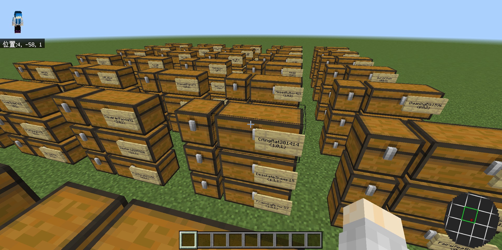

# ImportInventoryAsChest

## Introduction

- Import exported inventory backups of `InventoryExporter` back into game
- Each player's inventory, armor, offhand, enderchest items will be put into a pair of chests signed with his name.

## Screenshots

